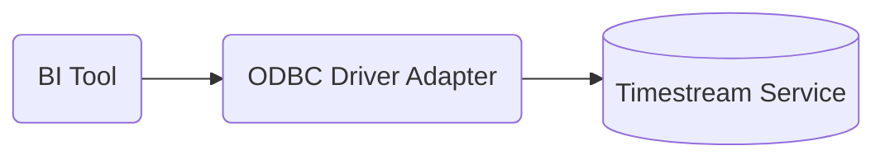

# Amazon Timestream ODBC Driver Documentation

## Overview

The ODBC driver for the Amazon Timestream managed document database provides an
SQL-relational interface for developers and BI tool users.

## License

This project is licensed under the Apache-2.0 License.

## Architecture

The ODBC driver is based on AWS SDK to connect and query from AWS Timestream database.


## Documentation

- Setup
    - [Amazon Timestream ODBC Driver Setup](setup/setup.md)
    - [DSN](setup/dsn-configuration.md)
- Development Envrionment
    - [Amazon Timestream ODBC Development Environment Setup](setup/developer-guide.md)
- Managing Schema
    - [Schema Discovery and Generation](https://github.com/aws/amazon-documentdb-jdbc-driver/blob/develop/src/markdown/schema/schema-discovery.md)
    - [Managing Schema Using the Command Line Interface](https://github.com/aws/amazon-documentdb-jdbc-driver/blob/develop/src/markdown/schema/manage-schema-cli.md)
    - [Table Schemas JSON Format](https://github.com/aws/amazon-documentdb-jdbc-driver/blob/develop/src/markdown/schema/table-schemas-json-format.md)
- SQL Compatibility
    - [SQL Support and Limitations](https://github.com/aws/amazon-documentdb-jdbc-driver/blob/develop/src/markdown/sql/sql-limitations.md)
- Support
    - [Troubleshooting Guide](support/troubleshooting-guide.md)
  
## Getting Started

Follow the [requirements and setup directions](setup/setup.md) to get your environment ready to use the
Amazon Timestream ODBC driver. If you're a Tableau or other BI user, follow the directions on how to 
[setup and use BI tools](setup/setup.md#driver-setup-in-bi-applications) with the driver.

## Setup and Usage

To set up and use the Timestream ODBC driver, see [Amazon Timestream ODBC Driver Setup](setup/setup.md).

## Connection String Syntax

```
DRIVER={Amazon Timestream};[HOSTNAME=<host>:<port>];[DATABASE=<database>];[USER=<user>];[PASSWORD=<password>][;<option>=<value>[;<option>=<value>[...]]];
```

For more information about connecting to an Amazon Timestream database using this ODBC driver, see
the [dsn configuration](setup/dsn-configuration.md) for more details.
## Schema Discovery

The Amazon Timestream ODBC driver can perform automatic schema discovery and generate an SQL to
Timestream schema mapping. See the [schema discovery documentation](https://github.com/aws/amazon-documentdb-jdbc-driver/blob/develop/src/markdown/schema/schema-discovery.md)
for more details of this process.

## Schema Management

The SQL to Timestream schema mapping can be managed using JDBC command line in the following ways:

- generated
- removed
- listed
- exported
- imported

See the [schema management documentation](https://github.com/aws/amazon-documentdb-jdbc-driver/blob/develop/src/markdown/schema/manage-schema-cli.md) and
[table schemas JSON format](https://github.com/aws/amazon-documentdb-jdbc-driver/blob/develop/src/markdown/schema/table-schemas-json-format.md) for further
information.

**Note**: A common schema management task is to regenerate or clear the existing schema that has
become out of date when your database has changed, for example, when there are new collections or new
fields in an existing collection. To regenerate or clear the existing schema, please refer to the
[Schema Out of Date](#schema-out-of-date) topic in the troubleshooting guide.

## SQL and ODBC Limitations

The Amazon Timestream ODBC driver has a number of important limitations. See the
[SQL limitations documentation](https://github.com/aws/amazon-documentdb-jdbc-driver/blob/develop/src/markdown/sql/sql-limitations.md)
and [Unicode support](support/unicode-support.md).

## Troubleshooting Guide

If you're having an issue using the Amazon Timestream ODBC driver, consult the
[Troubleshooting Guide](support/troubleshooting-guide.md) to see if it has a solution for
your issue.
