# Configure SAML 2.0 for AWS with Azure Active Directory

This is a guide to set up SAML 2.0 for AWS with Azure Active Directory. All steps listed on this page are required for account set up and having a successful ODBC connection. 

## Overview
- [Prerequisites](#prerequisites)
- [Setting up Azure AD](#setting-up-azure-ad)
- [Setting up the IAM provider and roles](#setting-up-iam-identity-provider-and-roles-in-aws)
    - [Overview](#overview-1)
    - [Creating the SAML identity provider](#create-a-saml-identity-provider)
    - [Create am IAM role](#create-an-iam-role)
    - [Create an IAM policy](#create-an-iam-policy)
    - [Provisioning](#provisioning)
- [Timestream ODBC DSN Configuration](#timestream-odbc-dsn-configuration)
- [Troubleshooting Guide](#troubleshooting-guide)

## Prerequisites
1. Admin permissions in AWS to create the identity provider and the roles.

2. An Azure Active Directory account: [https://azure.microsoft.com/en-ca/services/active-directory/](https://azure.microsoft.com/en-ca/services/active-directory/)

3. Access to Timestream.

## Setting up Azure AD
1. Sign in to [Azure Portal](https://portal.azure.com/#home).

2. Select `Azure Active Directory` in the list of Azure services, this will redirect to the `Default Directory` page.

3. Select `Enterprise Applications` under the `Manage` section on the sidebar:  
    
    
4. Select `+ New application` 

5. Find and select `AWS Single-Account Access`, click `Create`.
    
    

6. Select `Single sign-on` under `Manage` section in the sidebar:  
    
    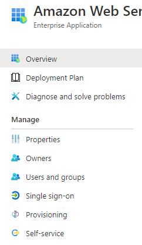

7. Choose SAML as the single sign-on method.

8. In the `Basic SAML Configuration`, enter `https://signin.aws.amazon.com/saml` for both the `Identifier` and the `Reply URL`:  
    
    
9. Click `Save`.

10. Download the `Federation Metadata XML` in the `SAML Signing Certificate` section. This will be used when creating the IAM Identity Provider later.  
    
    
    - If the Download link is greyed out, try refreshing the page.

11. Go back to the `Default Directory` page, select `App registrations` under `Manage`.  
    
    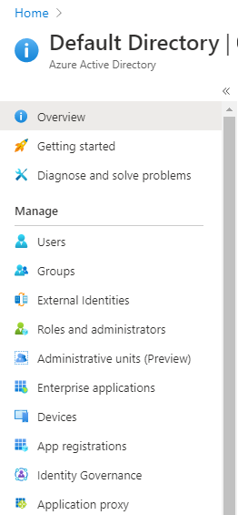

12. Select `AWS Single-Account Access` that you created in step 5 from the `All Applications` section, the page will be redirected to the application’s `Overview` page.
    

13. Take notes of the `Application (client) ID` and the `Directory (tenant) ID`, these values are required for when creating a connection:  
    
    

14. Select `Certificates & secrets`  
    
    

15. Under `Client secrets`, create a new client secret with `+ New client secret`. Take note of the generated value, this is required when creating a connection to Timestream.

    

16. On the sidebar under `Manage`, select `API permissions`.

    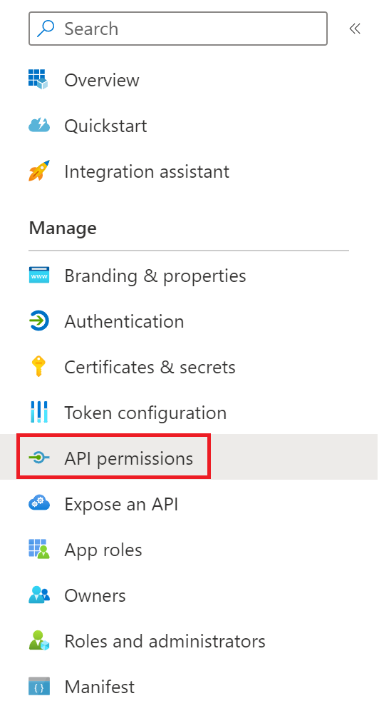

17. In the `Configured permissions`, use `Add a permission` to grant Azure AD permission to sign in to Timestream. Select `Microsoft Graph` on the `Request API permissions` page.   
    
    

18. Select `Delegated permissions`, select the `User.Read` permission.  
    
    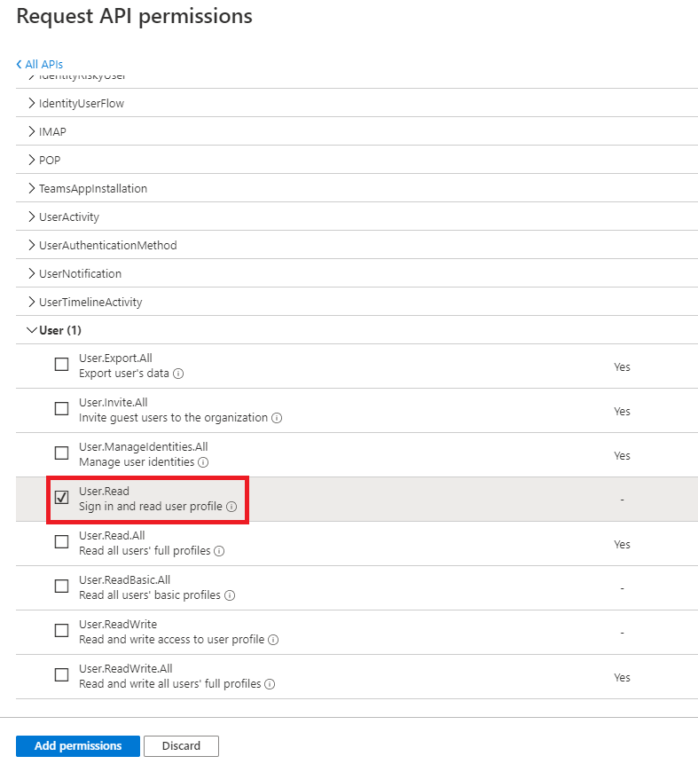
    
    - Click `Add permissions`.

19. Click `Grant admin consent for Default Directory`.  
    
    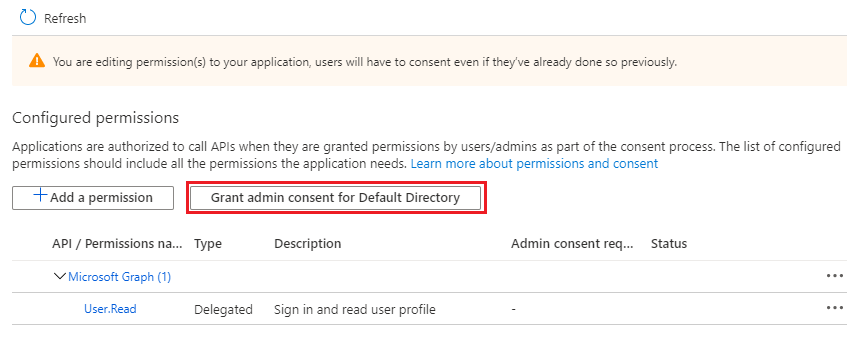

Azure AD set up process is now complete.

## Setting up IAM Identity Provider and Roles in AWS

### Overview
This set up will guide you through the following:

1. Creating the SAML identity provider.

2. Creating an IAM role for access to Timestream.

3. Creating an IAM policy allowing the IAM role to generate an AWS STS token to connect to Timestream.

#### Create a SAML Identity Provider
1. Sign in to the AWS Management Console.

2. Select Services and select IAM under Security, Identity, & Compliance.

3. Select Identity providers under Access management.

    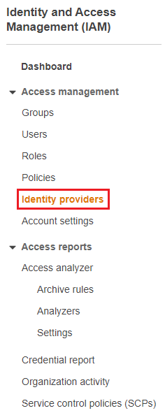

4. Select `Add Provider` and choose `SAML` as the provider type. Enter the Provider Name, this example will use AzureADProvider.

5. Upload the previously downloaded Federation Metadata XML file.

    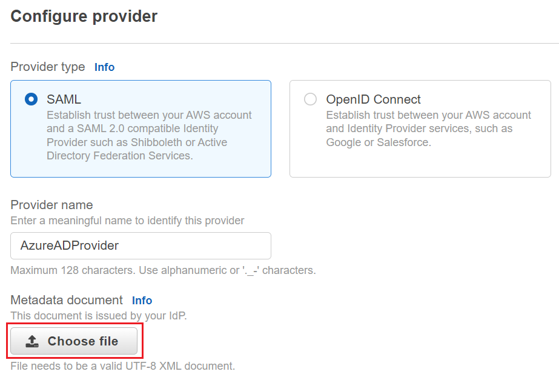

6. Select `Add provider`.

Upon completion, the page will be redirected back to the `Identity providers` page.

#### Create an IAM role
Pre-requisite: be on the page for `IAM` (follow steps 1-2 under ["Create a SAML Identity Provider"](#create-a-saml-identity-provider))

1. On the sidebar select `Roles` under `Access management`.

2. Select `Create role`.

3. Choose `SAML 2.0 federation` as the trusted entity.

4. Choose the Azure AD provider.

5. Select `Allow programmatic and AWS Management Console access`.

    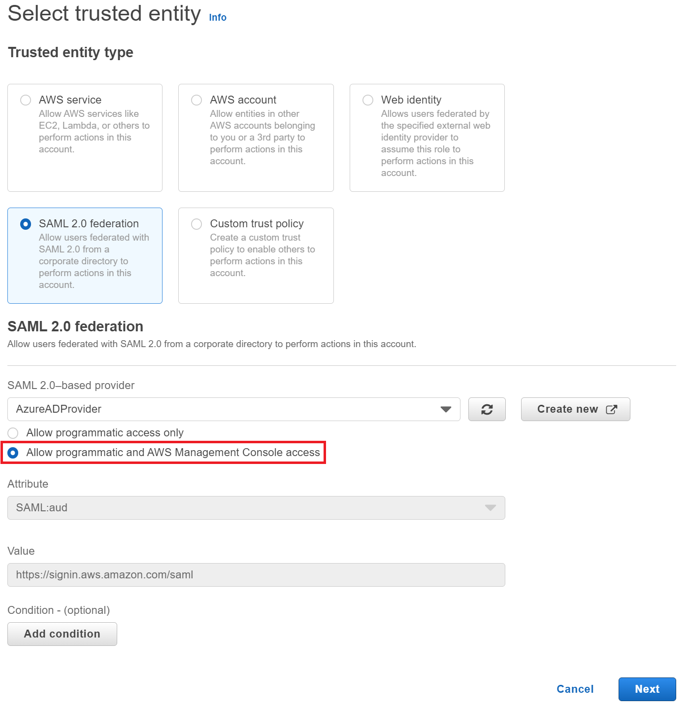

6. Click `Next` to set up permissions. 

7. Attach permissions policies or continue to `Next:Tags`. The role needs to have Timestream full access permission to access Timestream databases.

8. Add optional tags or continue to `Next:Review`.

9. Enter a `Role name`, this example will use `AzureSAMLRole`.

10. Provide a role description.

11. Click `Create Role` to complete.

#### Create an IAM Policy
Pre-requisite: be on the page for `IAM` (follow steps 1-2 under ["Create a SAML Identity Provider"](#create-a-saml-identity-provider))

1. On the sidebar select `Policies` under `Access management`.

2. Select `Create policy` and select the `JSON` tab.

3. Add the following policy:
```
{
    "Version": "2012-10-17",
    "Statement": [
        {
            "Effect": "Allow",
            "Action": [
                "iam:ListRoles",
                "iam:ListAccountAliases"
            ],
            "Resource": "*"
        }
    ]
}
```

4. Click `Next: Tags`. Add tags if needed.

5. Click `Next: Review`. Enter a policy name, this example will use `TimestreamAccessPolicy`.

6. Click `Create Policy`. 

7. On the sidebar select `Roles` under `Access management`. Select the previously created Azure AD role, select `Attach policies` under `Permissions`.

    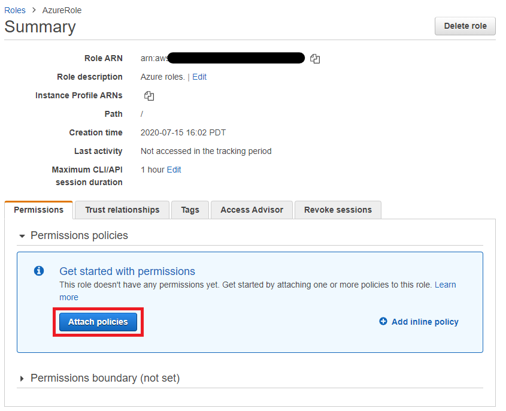

8. Select the previously created access policy.

#### Provisioning
1. Go back to Azure Portal. 

2. Select `Azure Active Directory` in the list of Azure services, this will redirect to the `Default Directory` page.

3. Select `Enterprise Applications` under the `Manage` section on the sidebar.

4. Select `AWS Single-Account Access` from the list.

5. Select `Provisioning` on the sidebar.

    

6. Click `Get started` and select `Automatic mode` for the `Provisioning Method`.

7. Under `Admin Credentials`, enter `AwsAccessKeyID` for `clientsecret` field, and `SecretAccessKey` for `Secret Token` field.

8. Click on `Test Connection` button to test the connection, ensure that the test passes before proceeding further. If testing fails, check that the AWS Access credentials that you entered is correct.  

    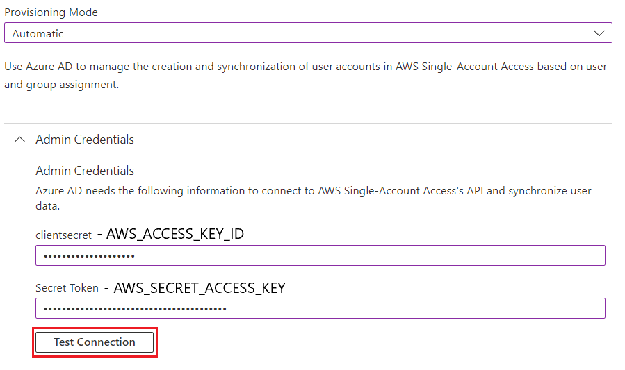

9. Make sure `Provisioning Status` is set to `on`. Click `Save` and go back to `Provisioning` home page.

10. Click `Start provisioning`. This allows Azure AD to load the necessary IAM Roles. You may need to refresh the page. Continue after the initial cycle is completed.

    

11. Once the `Current cycle status` is completed, go back to `AWS Single-Account Access` overview, and select `Users and groups` on the sidebar.

    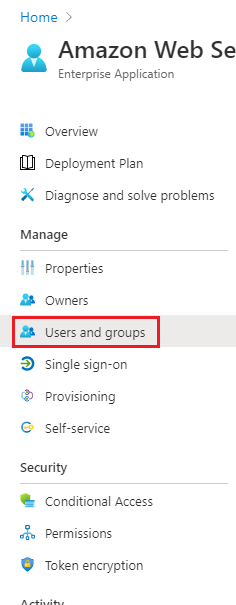

12. Select `+ Add user/group`.

13. Select the Azure AD user to provide access to Timestream.

14. Select the IAM Azure AD role and the corresponding Azure Identity Provider created in AWS.

    

    - If you are not able to select roles here or if the IAM Azure AD roles are missing, it’s likely because the initial cycle is not run for provisioning, make sure you finish step 10 and try again. 

15. Click `Assign`. Now you can proceed to login with credentials using the ODBC driver.

16. (Optional) Verify the Single-Sign-On (SSO) could work from Azure AD.

    i. Go back to `AWS Single-Account Access` overview, and select `Single sign-on` on the sidebar.

    

    ii. Scroll down the page to find "Test single sign-on with AWS Single-Account Access" section and click `Test.`

    

    iii. On the popped-up section, ensure `Sign in as current user` is selected. Click `Test sign in`. Then user should see that they have successfully signed-in to AWS Console Home with the linked AWS account. 

    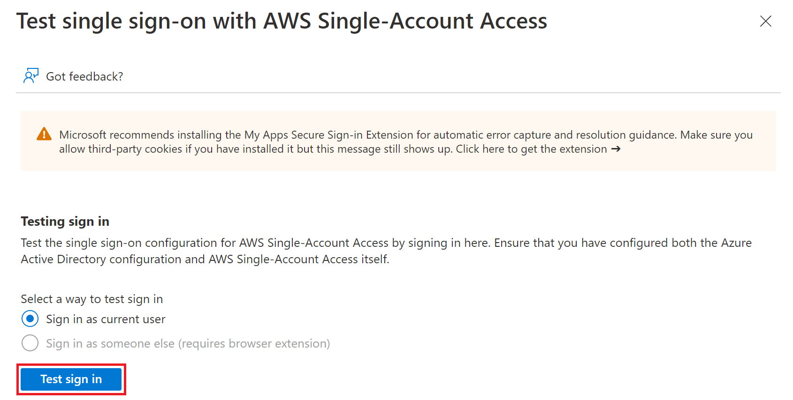
 

### Timestream ODBC DSN Configuration

Connection properties for Azure AD

| Option | Description | How to find the value |
|--------|-------------|---------------|
| `UID` or `IdPUserName` | The user name for the specified IdP account. | Use the username/email of the account that is used to log in to Microsoft Azure.
| `PWD` or `IdPPassword` | The password for the specified IdP account. | Use the password of the account that is used to log in to Microsoft Azure.
| `AADApplicationID` | The unique id of the registered application on Azure AD. | Use `Application ID` in step 13 under [setting up AzureAD](#setting-up-azure-ad)
| `AADClientSecret` | The client secret associated with the registered application on Azure AD used to authorize fetching tokens. | Use generated secret value from step 15 under [setting up AzureAD](#setting-up-azure-ad)
| `AADTenant` | The Azure AD Tenant ID. | Use `Directory (tenant) ID` in step 13 under [setting up AzureAD](#setting-up-azure-ad)
| `RoleARN` | The Amazon Resource Name (ARN) of the role that the caller is assuming. | The ARN value from the IAM role that is created in [Create am IAM role](#create-an-iam-role) and used in step 14 of [Provisioning](#provisioning)
| `IdPARN` | The Amazon Resource Name (ARN) of the SAML provider in IAM that describes the IdP. | The ARN value from the identity provider that is created in [Creating the SAML identity provider](#create-a-saml-identity-provider) and used in step 14 of [Provisioning](#provisioning)

### Troubleshooting Guide

1. Cannot sign in using Single-Sign-On (SSO) from Azure AD using user with email that includes `#EXT#<directory_name>.onmicrosoft.com`. E.g., `Jane.Doe_gmail.com#EXT#@defaultdirectory.onmicrosoft.com` would be a generated user email from original email `Jane.Doe@gmail.com`.

    Try using the original email of your Microsoft Azure AD instead. 

2. Able to sign in using Single-Sign-On (SSO) from Azure AD, but unable to sign in using Timestream ODBC Driver. 

    Double check that the Azure AD (AAD) credentials are entered correctly in the DSN. If all credentials are correct, note that it may take some time for Azure AD account to properly work after set up. Try sign in again in 1 hour after the Azure AD account set up is complete. 

