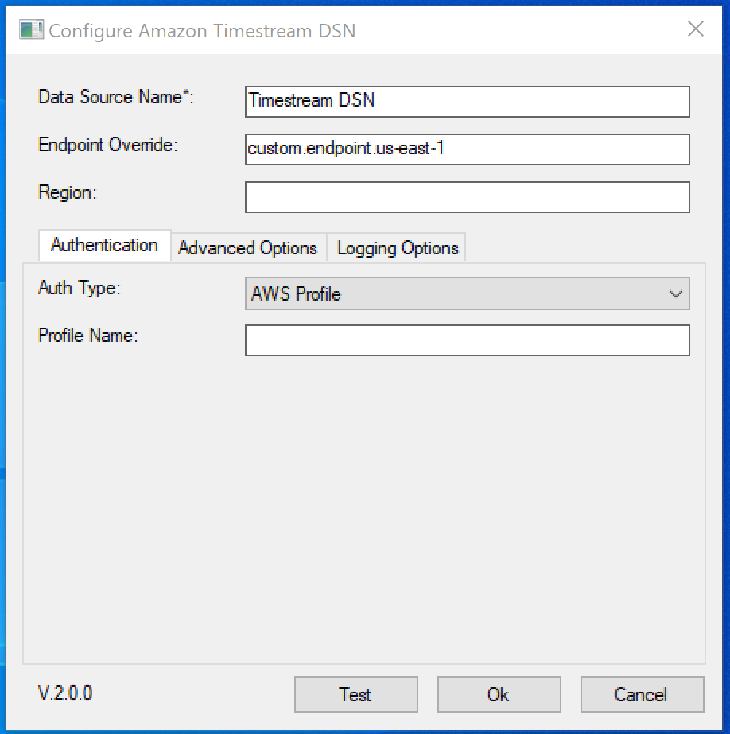
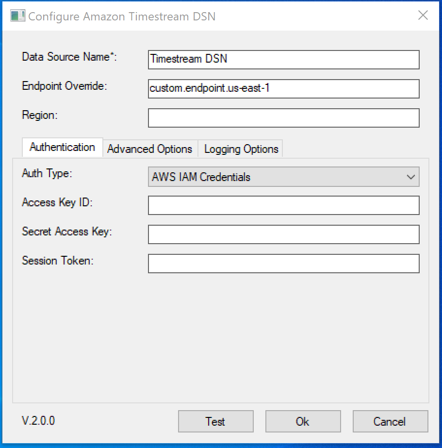
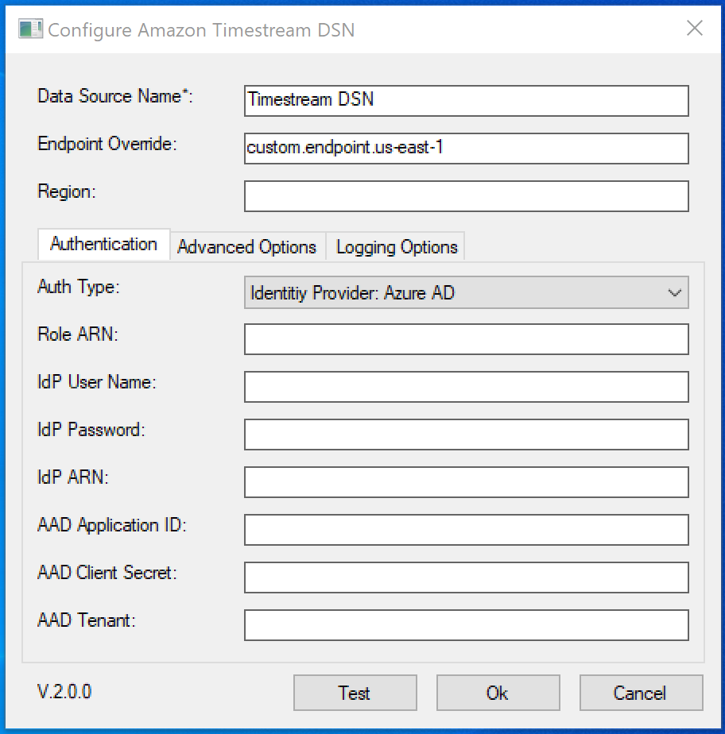
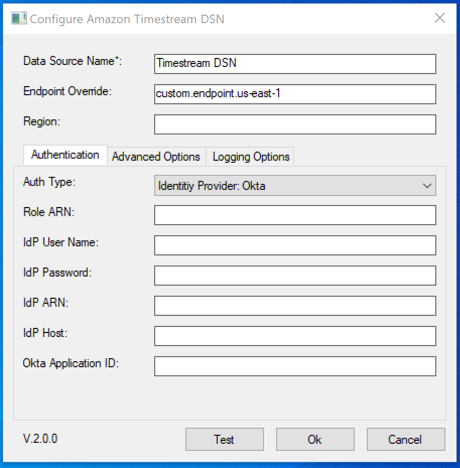
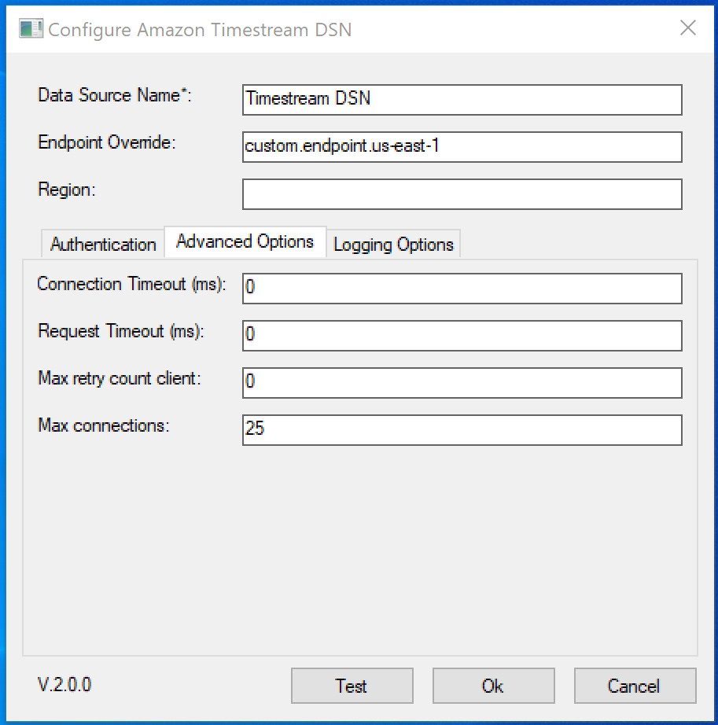
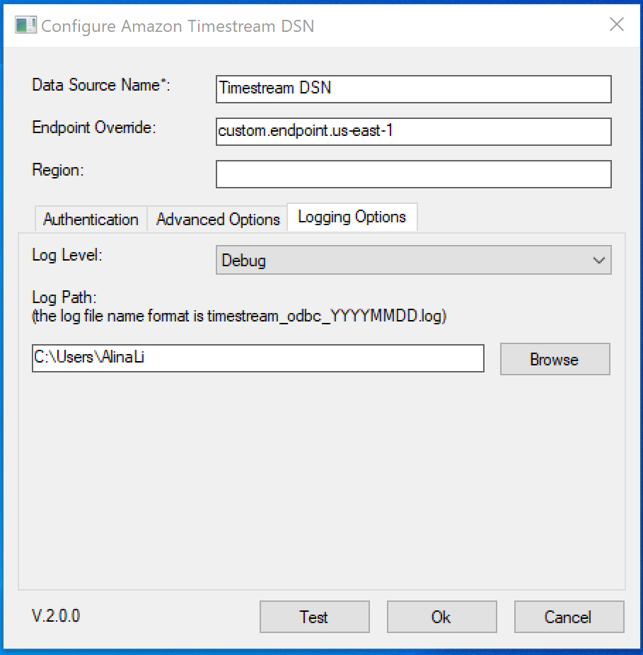

# Connection String Properties on New Timestream ODBC Driver

## Topics
- [Driver Connection Options](#driver-connection-options)
- [Endpoint Configuration Options](#endpoint-configuration-options)
- [Credentials Provider Options](#credentials-provider-options)
- [AWS IAM Authentication Options](#aws-iam-authentication-options)
- [SAML-Based Authentication Options for Okta](#saml-based-authentication-options-for-okta)
- [SAML-Based Authentication Options for Azure Active Directory](#saml-based-authentication-options-for-azure-active-directory)
- [AWS SDK (Advanced) Options](#aws-sdk-advanced-options)
- [Logging Options](#logging-options)
- [Environment Variables At Connection](#environment-variables-at-connection)
    - [AWS SDK Log Level](#aws-sdk-log-level)
- [Connecting to an Amazon Timestream Database](#connecting-to-an-amazon-timestream-database)
    - [Connecting With IAM Credentials](#connecting-with-iam-credentials)
    - [Connecting With Profile](#connecting-with-profile)
- [Troubleshooting](#troubleshooting)
- [Window Dialog](#window-dialog)

# Connection String Syntax and Options
`DRIVER={Amazon Timestream ODBC Driver};<option>=<value>;`

### Driver Connection Options
| Option | Description | Default |
|--------|-------------|---------------|
| `Driver` | Required: the driver for this ODBC driver. | Amazon Timestream 
| `DSN` | Data Source Name used for configuring the connection. | `NONE`
| `Auth` | Authentication mode. One of `AWS_PROFILE`, `IAM`, `AAD`, `OKTA`. <br /> AWS_PROFILE - use default credential chain <br /> IAM -  AWS IAM credentials  <br /> AAD - Identitiy provider: Azure AD <br /> OKTA - Identitiy provider: Okta | `AWS_PROFILE` 

### Endpoint Configuration Options

| Option | Description | Default |
|--------|-------------|---------------|
| `EndpointOverride` | The endpoint override for the Timestream service. It overrides the region. It is an advanced option. <br /> Example value: <br /> query-cell2.timestream.us-east-1.amazonaws.com | `NONE`
| `Region` | The signing region for the Timestream service endpoint. | `us-east-1` 

### Credentials Provider Options

| Option | Description | Default |
|--------|-------------|---------------|
| `ProfileName` | The profile name on the [AWS config file](https://docs.aws.amazon.com/sdk-for-net/v3/developer-guide/creds-file.html). This is optional. | `NONE` 

### AWS IAM Authentication Options

| Option | Description | Default |
|--------|-------------|---------------|
| `UID` or `AccessKeyId` | The AWS user access key id. If both `UID` and `AccessKeyId` are provided in the connection string, the non-empty value with `UID` will be used. | `NONE` 
| `PWD` or `SecretKey` | The AWS user secret access key. If both `PWD` and `SecretKey` are provided in the connection string, the non-empty value with `PWD` will be used. | `NONE` 
| `SessionToken` | The temporary session token required to access a database with multi-factor authentication (MFA) enabled. Do not include trailing "=" in the input. | `NONE` 

### SAML-Based Authentication Options for Okta

| Option | Description | Default |
|--------|-------------|---------------|
| `IdPHost` | The hostname of the specified IdP. | `NONE`
| `UID` or `IdPUserName` | The user name for the specified IdP account. If both `UID` and `IdPUserName` are provided in the connection string, the non-empty value with `UID` will be used. | `NONE`
| `PWD` or `IdPPassword` | The password for the specified IdP account. If both `PWD` and `IdPPassword` are provided in the connection string, the non-empty value with `PWD` will be used. | `NONE`
| `OktaApplicationID` | The unique Okta-provided ID associated with the Timestream application. A place to find the AppId is in the entityID field provided in the application metadata. An example entityID=`"http://www.okta.com//<IdPAppID>"`| `NONE`
| `RoleARN` | The Amazon Resource Name (ARN) of the role that the caller is assuming. | `NONE`
| `IdPARN` | The Amazon Resource Name (ARN) of the SAML provider in IAM that describes the IdP. | `NONE`

### SAML-Based Authentication Options for Azure Active Directory

For how to find the connection values, go to the [SAML 2.0 Azure AD set up guide](/docs/markdown/setup/aad-saml-setup.md#timestream-odbc-dsn-configuration).

| Option | Description | Default |
|--------|-------------|---------------|
| `UID` or `IdPUserName` | The user name for the specified IdP account. | `NONE`
| `PWD` or `IdPPassword` | The password for the specified IdP account. | `NONE`
| `AADApplicationID` | The unique id of the registered application on Azure AD. | `NONE`
| `AADClientSecret` | The client secret associated with the registered application on Azure AD used to authorize fetching tokens. | `NONE`
| `AADTenant` | The Azure AD Tenant ID. | `NONE`
| `RoleARN` | The Amazon Resource Name (ARN) of the role that the caller is assuming. | `NONE`
| `IdPARN` | The Amazon Resource Name (ARN) of the SAML provider in IAM that describes the IdP. | `NONE`

### AWS SDK (Advanced) Options

| Option | Description | Default |
|--------|-------------|---------------|
| `RequestTimeout` | The time in milliseconds the AWS SDK will wait for a query request before timing out. Non-positive value disables request timeout. | `3000`
| `ConnectionTimeout` | The time in milliseconds the AWS SDK will wait for data to be transferred over an open connection before timing out. Value must be non-negative. A value of 0 disables connection timeout.| `1000`
| `MaxRetryCountClient` | The maximum number of retry attempts for retryable errors with 5XX error codes in the SDK. The value must be non-negative.| `0`
| `MaxConnections` | The maximum number of allowed concurrently opened HTTP connections to the Timestream service. The value must be positive.| `25`

### Logging Options

| Option | Description | Default |
|--------|-------------|---------------|
| `LogLevel` | Log level for driver logging. <br />Possible values:<br /> {0, 1, 2, 3, 4}<br /> meaning<br />{OFF, ERROR, WARNING, INFO, DEBUG}<br /> **Warning:** personal information can be logged by the driver when using the driver in **DEBUG** mode. | `1` (means ERROR)
| `LogOutput` | Folder to store the log file | Windows: `%USERPROFILE%`, or if not available, `%HOMEDRIVE%%HOMEPATH%` <br /> macOS/Linux: `$HOME`, or if not available, use the field `pw_dir` from C++ function `getpwuid(getuid())` return value.

### Environment Variables At Connection
For setting up connection proxy properties, see [connection proxy guide.](connection-proxy-guide.md).

#### AWS SDK Log Level
AWS SDK Log Level can be set by envrionment variable `TS_AWS_LOG_LEVEL` to one of valid log level values: "FATAL", "ERROR", "WARN", "INFO", "DEBUG", "TRACE", and "OFF". If environment variable `TS_AWS_LOG_LEVEL` is not set, default log level `Warn` is used.

Note that AWS SDK log level is separate from the Timestream ODBC driver log level, and setting one does not affect the other.

## Examples

### Connecting to an Amazon Timestream Database

#### Connecting With IAM Credentials

```
Driver={Amazon Timestream ODBC Driver};Auth=IAM;AccessKeyId=myAccessKeyId;secretKey=mySecretKey;SessionToken=mySessionToken;Region=us-east-2;
```

#### Notes

1. Authentication type (Auth) is AWS IAM credentials.
2. AccessKeyId is `accessKeyId` and SecretKey is `secretKey`.
3. Session token is `sessionToken`.
4. Region is `us-east-2`. 

#### Connecting With Profile

```
Driver={Amazon Timestream ODBC Driver};ProfileName=myProfileName;
```

#### Notes

1. Authentication type (Auth) is AWS Profile by default if not specified.
2. ProfileName is `myProfileName`. The driver will attempt to connect with credentials provided in `~/.aws/credentials` (or, if provided, the file in the environment variable `AWS_SHARED_CREDENTIALS_FILE`).

## Troubleshooting

Note: When the username / password are already specified in the DSN, there is no need to specify them again when the ODBC driver manager asks for them.

| Error code | Message | Explanation |
|------------|---------|-------|
| 01S02 | Re-writing < connection string option > (have you specified it several times? | When user passes < connection string option > more than once in the connection string, this error will happen. Please do not pass in the same connection option more than once in the connection string. When making a connection with a DSN and a connection string, if a connection option is already specified in the DSN, it is not recommended to specify it again in the connection string. 

### Window Dialog

The following are the screenshots of the Windows ODBC driver UI.












