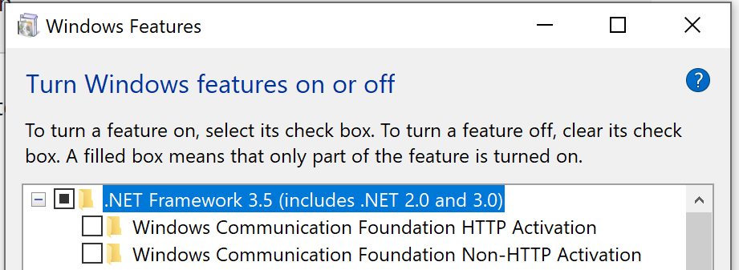

# Development Environment
## Pre-requisites

### C/C++ Formatting

- This project uses [Google's C++ Style Guide](https://google.github.io/styleguide/cppguide.html) as a basis for
C/C++ usage and formatting.
- Some formatting is set using the .clang-format file at the base of repository. Other options for Visual Studio can be imported from the
`VS-C++-Settings-Export.vssettings` file also found at root of repository.

### Environment Variables for Testing Accounts/Secrets
- To use IAM accessKeyId and secretKey to access AWS Timestream, you need to specify the following environment variables.

   | Enviornment Variable | Description |
   |----------------------|-------------|
   | AWS_ACCESS_KEY_ID | `<AWS Access Key ID>` |
   | AWS_SECRET_ACCESS_KEY | `<AWS Secret Access Key>` |
   | AWS_SESSION_TOKEN | `<Session Token>`, if your account is enabled with MFA

- [ Optional ] Log configurations

  Set these 2 variables only if you would like to set a custom log path or log level for connection tests; it is completely optional.
    1. `TIMESTREAM_LOG_PATH`=`<path_to_log_file>`(e.g.:`"C:\\Users\\BitQuillUser\\Desktop\\Timestream ODBC Driver"`)

    The user needs to ensure that the directory mentioned in the log file path exists or the driver will ignore the user's passed-in value and create the log file in the default log path. Do **not** include a slash at the end of the log path.

    The log path indicates the path to store the log file. The log file name is formatted as `timestream_odbc_YYYYMMDD.log`, where `YYYYMMDD` (e.g., 20220225 <= Feb 25th, 2022) is the date at the first log message.

    2. `TIMESTREAM_LOG_LEVEL`=`<log_level>`. The default is `2` (means WARNING Level). Possible values:
         - 0: OFF
         - 1: ERROR
         - 2: WARNING
         - 3: INFO
         - 4: DEBUG

    More details about logging in [`support\troubleshooting-guide.md`](../support/troubleshooting-guide.md).

- AWS Logs

  This ODBC driver uses AWS logs beside its own logging. Please see how AWS Logs work in their [official document](https://docs.aws.amazon.com/sdk-for-cpp/v1/developer-guide/logging.html). The logs will be stored inthe executable directory following the default naming pattern of `aws_sdk_<date>.log`.

## Windows

1. Microsoft Visual Studio (Community 2019 Verified)
   1. Desktop Development for C++
   2. Visual Studio core editor
   3. C++ ATL for latest v142 build tools (x86 & x64)
   4. C++ MFC for latest v142 build tools (x86 & x64)
   5. [WiX Toolset v3 Schemas for Visual Studio](https://wixtoolset.org/docs/wix3/)
      If encountering "wix toolset requires .net 3.5.1 to be enabled", follow the steps below.
      1. Open Settings -> Apps -> Optional Features -> Under "Related Settings", click on "More Windows features", and select ".Net Framework 3.5".
      
   6. [WiX Toolset Visual Studio 2019 Extension](https://marketplace.visualstudio.com/items?itemName=WixToolset.WiXToolset)
2. OpenSSL (full)
   1. Installed via [VCPKG](https://vcpkg.io/en/getting-started.html) (`.\vcpkg install openssl`).
   2. Or installed via [Chocolatey](https://community.chocolatey.org/packages/openssl).
   3. Ensure to set the OPENSSL_ROOT_DIR.
3. [WiX Installer (3.11)](https://wixtoolset.org/releases/)
   1. Ensure to add path to WiX executables (e.g. `C:\Program Files (x86)\WiX Toolset v3.11\bin`)
4. Boost Test Framework
   1. Install [VCPKG](https://vcpkg.io/en/getting-started.html)
   2. `cd vcpkg`
   3. Checkout 2022.09.27 to ensure AWS SDK 1.9.220 is used.

      `git checkout 2022.09.27`

   4. Install Boost and AWS SDK

      `.\vcpkg install openssl:x64-windows boost-test:x64-windows boost-asio:x64-windows boost-chrono:x64-windows boost-interprocess:x64-windows boost-regex:x64-windows boost-system:x64-windows boost-thread:x64-windows "aws-sdk-cpp[core,sts,timestream-query,timestream-write]:x64-windows" --recurse`
5. Run `.\vcpkg integrate install` to implicitly add Include Directories, Link Directories, and Link Libraries for all packages installed with Vcpkg to all VS2015, VS2017 and VS2019 MSBuild projects
6. On the Developer PowerShell, run one of the build scripts to create an initial compilation.
   1. E.g.: `.\build_win_debug64.ps1`
   2. Navigate to the `build\odbc\cmake` folder to use the generated solution file, `Ignite.C++.sln` to work on
   source code development and testing.
7. Open a **64-bit** command shell or **64-bit** PowerShell window, **as Administrator**, run the command below
   ```
   .\<repo-folder>\src\odbc\install\install_amd64.cmd <repo-folder>\build\odbc\cmake\Debug\timestream.odbc.dll
   ```
   Ensure that backslashes are used in your command.
8. Set environment variable REPOSITORY_ROOT to your repository root.
9. Run `.\src\tests\input\create_credentials_file.ps1` to create credential files for testing. Note that this script will write AWS IAM credentials file `src\tests\input\credentials`.
10. Set environment variable AWS_SHARED_CREDENTIALS_FILE to the newly created credentials file.
11. Now you're ready to begin [configuration for integration and unit testing](#integration-tests).
12. Once configured, run the tests:
    - Run integration tests: `.\build\odbc\bin\<Release or Debug>\timestream-odbc-integration-tests.exe`.
    - Run unit tests: `.\build\odbc\bin\<Release or Debug>\timestream-odbc-unit-tests.exe`.

## MacOS

1. Install dependencies
   1. `brew install cmake`
   2. `brew install openssl`
   3. `brew install libiodbc`  
      - You may need to unlink `unixodbc` if you already have this installed. Use `brew unlink unixodbc`.
      - You may need to run `brew link --overwrite --force libiodbc`.
   4. `brew install boost`
   5. If creating a debug build (`./build_mac_debug64.sh`), LLVM is required.
      - If you only have XCode Command Line Tools, use the LLVM included with XCode by modifying the PATH with `export PATH=/Library/Developer/CommandLineTools/usr/bin/:$PATH`. Ensure this XCode path comes first in $PATH. If error occurs, check that clang and llvm are under folder Library/Developer/CommandLineTools/usr/bin.
      - If you have XCode application, to ensure LLVM and CMake are compatible, use the LLVM included with XCode by modifying the PATH with `export PATH=/Applications/Xcode.app/Contents/Developer/Toolchains/XcodeDefault.xctoolchain/usr/bin/:$PATH`.
2. Run one of the build scripts to create an initial compilation.
   1. E.g.: from the root of the Timestream ODBC repository, run `./build_mac_release64.sh`
   2. The generated driver files will be placed in the `build/odbc/lib` folder.
3. Set the environment variable `ODBCINSTINI`. On a developer's machine, set it to `<repo-folder>/build/odbc/lib/timestream-odbc-install.ini`.
4. Set the environment variable `DYLD_LIBRARY_PATH`. On a developer's machine, set it to `<repo-folder>/build/odbc/lib:$DYLD_LIBRARY_PATH`.
5. Run the following command to register the ODBC driver.
   `./scripts/register_driver_unix.sh`.
6. Set environment variable REPOSITORY_ROOT to your repository root

    `export REPOSITORY_ROOT=<your repository root>`
7. Run `./src/tests/input/create_credentials_file.sh` from the respository root to create credential files for testing. Note that this script will write AWS IAM credentials file `src/tests/input/credentials`.
8. Set environment variable AWS_SHARED_CREDENTIALS_FILE

    `export AWS_SHARED_CREDENTIALS_FILE=$REPOSITORY_ROOT/src/tests/input/credentials`
9. Now you're ready to begin [configuration for integration and unit testing](#integration-tests).
10. Once configured, run the tests:
      - Run integration tests: `./build/odbc/bin/timestream-odbc-integration-tests --catch_system_errors=false`.
      - Run unit tests: `./build/odbc/bin/timestream-odbc-unit-tests  --catch_system_errors=false`.

You should have all the following environment variables set. If you encounter any issues, check that these variables
have all been set correctly:
- `AWS_ACCESS_KEY_ID` (from prerequisites)
- `AWS_SECRET_ACCESS_KEY` (from prerequisites)
- `ODBCINSTINI`
- `DYLD_LIBRARY`
- `REPOSITORY_ROOT`
- `AWS_SHARED_CREDENTIALS_FILE`

### Known issues

### 'odbcinst.h' file not found
When [iODBC Administrator](https://www.iodbc.org/dataspace/doc/iodbc/wiki/iodbcWiki/Downloads) is installed on the local machine, performance test executable is unable to build with the error 'odbcinst.h' file not found. The workaround is to copy `/Library/Frameworks/iODBCinst.framework/Headers/odbcinst.h` to `/Library/Frameworks/iODBC.framework/Headers/odbcinst.h`, then the build should succeed.
```
# example command
sudo cp /Library/Frameworks/iODBCinst.framework/Headers/odbcinst.h /Library/Frameworks/iODBC.framework/Headers
```

### Cannot build with macOS SDK 13
Currently, the AWS SDK CPP is incompatible with SDK 13. The workaround is to set the SDK folder to a compatible SDK (e.g., SDK 12.3) that is before SDK 13, and upgrade the sdk version.

1. Set environment MACOSX_DEPLOYMENT_TARGET to a compatible SDK version. (e.g., `export MACOSX_DEPLOYMENT_TARGET=12.3`)

2. Set the SDK folder location and minimum SDK version by appending `-DCMAKE_OSX_SYSROOT=<Path/to/SDK> -DCMAKE_OSX_DEPLOYMENT_TARGET=<SDK_Version>` to `cmake ...` command in `build_mac_*64.sh`. The change needs to be applied to both aws-sdk-cpp build and ODBC driver build.
```
# example command for machines with macOS SDK 12.3. Replace aws-sdk-cpp cmake command in build_mac_debug64.sh with the following:
cmake ../ -DCMAKE_INSTALL_PREFIX="../install" -DTARGET_ARCH="APPLE" -DCMAKE_BUILD_TYPE="Debug" -DBUILD_ONLY="core;sts;timestream-query;timestream-write" -DCUSTOM_MEMORY_MANAGEMENT="OFF" -DENABLE_TESTING="OFF" -DBUILD_SHARED_LIBS="OFF" -DCMAKE_OSX_SYSROOT=/Library/Developer/CommandLineTools/SDKs/MacOSX12.3.sdk -DCMAKE_OSX_DEPLOYMENT_TARGET=12.3
```

```
# example command for machines with macOS SDK 12.3. Replace ODBC driver cmake command in build_mac_debug64.sh with the following:
cmake ../src -DCMAKE_BUILD_TYPE="$BUILD_TYPE" -DCODE_COVERAGE="ON" -DBUILD_SHARED_LIBS="OFF" -DWITH_TESTS="ON" -DWITH_ODBC="ON"  -DCMAKE_OSX_SYSROOT=/Library/Developer/CommandLineTools/SDKs/MacOSX12.3.sdk -DCMAKE_OSX_DEPLOYMENT_TARGET=12.3
```

3. Set `sysroot` in `src/CMakeLists.txt`
```
# example command. Replace current `set(CMAKE_CXX_FLAGS ...)` with the following
set(CMAKE_CXX_FLAGS "--sysroot ${CMAKE_OSX_SYSROOT} ${CMAKE_CXX_FLAGS} -DIGNITE_IMPL -DIGNITE_FRIEND -D__STDC_LIMIT_MACROS -D__STDC_CONSTANT_MACROS")
```

## Linux

### Using docker

#### Pre-requisites

1. Build docker image
   1. Navigate Dockerfile folder `cd docker/linux-environment`
   2. Build the docker image E.g.: `docker build -t timestream-dev-linux .`
2. Ensure DockerHub application is opened.

#### Using the dev image

1. Run docker container with interactive mode. E.g.: `docker run --add-host host.docker.internal:host-gateway -v "<path-to-repo>:/timestream-odbc" -it timestream-dev-linux`
2. Next steps all are from inside the container
   1. Set environment variables for testing and double-check if all dev environmnet variables are set by running `scripts/env_variables_check.sh`. More info [Environment Variables for Testing Accounts/Secrets ](#environment-variables-for-testing-accounts/secrets)
      Note. Since the environment variables `ODBC_LIB_PATH`, `REPOSITORY_ROOT`, and `VCPKG_ROOT` are already set in the container, it is not recommended to change those.
   2. Git clone `vcpkg` and install the dependencies by running the following command
    ```
    git clone https://github.com/Microsoft/vcpkg.git \
    && cd vcpkg \
    && git checkout 2022.09.27 \
    && ./bootstrap-vcpkg.sh \
    && ./vcpkg install "aws-sdk-cpp[core,sts,timestream-query,timestream-write]" --recurse
    ```
   3. Run one of the build scripts to create an initial compilation. E.g. `./build_linux_debug64_deb.sh` or `./build_linux_release64_deb.sh`
   4. Run the following command to register the ODBC driver.
      `./scripts/register_driver_unix.sh`
   5. Set environment variable REPOSITORY_ROOT to your repository root

        `export REPOSITORY_ROOT=<your repository root>`
   6. Run `./src/tests/input/create_credentials_file.sh` to create credential files for testing. Note that this script will write AWS IAM credentials file `src/tests/input/credentials`.
   7. Set environment variable AWS_SHARED_CREDENTIALS_FILE

       `export AWS_SHARED_CREDENTIALS_FILE=$REPOSITORY_ROOT/src/tests/input/credentials`
   8. You are ready to run the tests.
   E.g. `./build/odbc/bin/timestream-odbc-integration-tests --catch_system_errors=false`
   E.g. `./build/odbc/bin/timestream-odbc-unit-tests --catch_system_errors=false`

#### Known issues

If a windows host machine is used, it is possible to have an issue with end of line character in the *.sh files.
There are two ways to fix the issue.
   1. Ensure that your GitHub is checking out the files as Unix-style https://docs.github.com/en/get-started/getting-started-with-git/configuring-git-to-handle-line-endings
   2. Alternatively you can convert the end-of-line using the following command `tr -d '\015' < build_linux_debug64_deb.sh > build_linux_debug64_deb_lf.sh` and run `./build_linux_debug64_deb_lf.sh` to build.
      1. Note that the command will need to be executed for all scripts that you will run in the container (register_driver_unix.sh,env_variables_check.sh and any other that you might need).
### Using Ubuntu 64bit

1. Install all dependencies
   1. Ubuntu dev dependencies
      E.g.
```
           apt-get -y update \
           && apt-get -y install wget \
                                 curl \
                                 libcurl4-openssl-dev \
                                 libssl-dev \
                                 uuid-dev \
                                 zlib1g-dev \
                                 libpulse-dev \
                                 gcc \
                                 gcc-multilib  \
                                 g++ \
                                 g++-multilib \
                                 build-essential \
                                 valgrind \
                                 libboost-all-dev \
                                 libsasl2-dev \
                                 lcov \
                                 git \
                                 unixodbc-dev \
                                 valgrind \
                                 zip \
                                 unzip \
                                 tar                            
```
   2. Install VCPKG and install aws-sdk-cpp dependencies
```
           cd <odbc-repo> \
           git clone https://github.com/Microsoft/vcpkg.git \
           && cd vcpkg \
           && git checkout 2022.09.27 \
           && ./bootstrap-vcpkg.sh \
           && ./vcpkg install "aws-sdk-cpp[core,sts,timestream-query,timestream-write]" --recurse \
           export VCPKG_ROOT=<odbc-repo>/vcpkg
```
   3. Set all necessary environment variables and run the following command to register the ODBC driver.
      `./scripts/register_driver_unix.sh`
   4. Run one of the build scripts to create an initial compilation. E.g. `./build_linux_release64_deb.sh`
   5. Set environment variables for testing and double-check if all dev environmnet variables are set running `scripts/env_variables_check.sh`.
   6. Set environment variable REPOSITORY_ROOT to your repository root

        `export REPOSITORY_ROOT=<your repository root>`
   7. Run `./src/tests/input/create_credentials_file.sh` to create credential files for testing. Note that this script will write AWS IAM credentials file `src/tests/input/credentials`.
   8. Set environment variable AWS_SHARED_CREDENTIALS_FILE

       `export AWS_SHARED_CREDENTIALS_FILE=$REPOSITORY_ROOT/src/tests/input/credentials`
   9. Now you're ready to begin [configuration for integration and unit testing](#integration-tests).
   10. Once configured, run the tests:
         - Run integration tests: `/timestream-odbc/build/odbc/bin/timestream-odbc-integration-tests --catch_system_errors=false`.
         - Run unit tests: `/timestream-odbc/build/odbc/bin/timestream-odbc-unit-tests --catch_system_errors=false`.

### Build Linux 32-bit Deb/Rpm package on Ubuntu 64bit
1. Run the following commands to install needed packages
```
   sudo dpkg --add-architecture i386
   sudo apt update
   sudo apt install unixodbc-dev:i386 odbcinst1debian2:i386 libodbc1:i386 libcurl4-openssl-dev:i386 libssl-dev:i386 uuid-dev:i386 cpp:i386 cpp-9:i386 gcc:i386 g++:i386 zlib1g-dev:i386 linux-headers-$(uname -r) gcc-multilib:i386 g++-multilib:i386 cmake g++-9:i386 gcc-9:i386 gcc-9-multilib:i386 g++-9-multilib:i386 binutils:i386 make:i386
```
2. Install git

    `sudo apt install git`
3. Install Cmake 3.24
```
   sudo apt install pip
   sudo pip install cmake
```
4. Install lcov for Debug build only. It needs to build from source https://github.com/linux-test-project/lcov.
```
   git clone git@github.com:linux-test-project/lcov.git
   cd lcov
   sudo make install
```
5. Build and install Boost. It needs to build from source
```
   wget https://boostorg.jfrog.io/artifactory/main/release/1.75.0/source/boost_1_75_0.tar.gz
   tar xf boost_1_75_0.tar.gz
   cd boost_1_75_0
   ./bootstrap.sh \
   --libdir=/usr/local/lib \
   --with-libraries=system,thread,test,chrono,regex,date_time,filesystem,locale,random,atomic,log,program_options,exception
   ./b2 -j 8
   sudo ./b2 install
```
6. [Optional] Install rpm if you want to build RPM package from Ubuntu.

   `sudo apt install rpm`
7. Run one of the build scripts to build the DEB or RPM package. E.g. `./build_linux_release32_deb.sh`

### Known issues

When running integration tests you may encounter the error
```
message: 01000: [unixODBC][Driver Manager]Can't open lib 'Amazon Timestream ODBC Driver' : file not found
```
Running `./scripts/register_driver_unix.sh` and copying `/etc/odbcinst.ini` to `$HOME/.odbcinist.ini` and `/etc/odbc.ini` to `$HOME/.odbc.ini` may help the Driver and DNS be discovered.

## Code Coverage

### MacOS/Linux
To generate code coverage reports you to need to use the debug builds for macOS/Linux, run the tests and use `gcovr` to compile the report. For an installation guide and how to use it look at the official (documentation)[https://gcovr.com/en/stable/index.html].
If you want to check a detailed report generate the with `--html-details` option.

### Windows
OpenCppCoverage is used to generate code coverage for windows, for more information check it in the official (documentation)[https://github.com/OpenCppCoverage/OpenCppCoverage]

## Versioning
1. To set the version of the ODBC driver, update the `src/ODBC_DRIVER_VERSION.txt` file with the appropriate version.

## Database Reporting
By default, the Timestream ODBC driver reports databases as catalogs. This behavior is matching with Timestream ODBC Driver version 1.0.0, and it is due to Excel on macOS not showing tables with duplicate names when databases are reported as schemas.
Driver will report databases as schemas when the user exports environment variable `DATABASE_AS_SCHEMA` to `TRUE`.
|   Value of `DATABASE_AS_SCHEMA`  | Behavior of driver                                                           |
|----------------------------------|------------------------------------------------------------------------------|
| `TRUE`                           | Databases are reported as schemas. Catalogs will not be supported by driver. |
| any other value/unset            | Databases are reported as catalogs. Schemas will not be supported by driver. |


## Data Population for Testing
[Data Population Guide](data-population-guide.md)

## Integration Tests

### Azure AD Authentication Tests

1. The Azure AD authentication tests are disabled by default because they require valid Azure AD test account. They can be enabled by exporting environment variable `ENABLE_AAD_TEST` to `true`.

2. For AAD integration tests to be run successfully, you need to specify the following environment variables. For instructions on how to set-up and find the AAD connection property values, go to the [SAML 2.0 Azure AD set up guide](/docs/markdown/setup/aad-saml-setup.md#timestream-odbc-dsn-configuration).

   |     Variable Name    | Corresponding Connection String Option |
   |----------------------|----------------------------------------|
   | `AAD_APP_ID`         | AADApplicationID                       |
   | `AAD_ROLE_ARN`       | RoleARN                                |
   | `AAD_IDP_ARN`        | IdPARN                                 |
   | `AAD_TENANT`         | AADTenant                              |
   | `AAD_USER`           | UID or IdPUserName                     |
   | `AAD_USER_PWD`       | PWD or IdPPassword                     |
   | `AAD_CLIENT_SECRET`  | AADClientSecret                        |

### Okta Authentication Tests
1. The Okta authentication tests are disabled by default because they require a valid Okta test account. They can be enabled by exporting environment variable `ENABLE_OKTA_TEST` to `true`.

2. To run Okta authentication test, the environment variables in the following table need to be configured with correct values.  Refer to [Okta Authentication Setup Guide](Okta-setup.md) for instructions on setting up an Okta authentication.

   | Variable Name |  Corresponding Connection String Option   |
   |---------------|-------------------------------------------|
   |`OKTA_HOST`    |   IdPHost                                 |
   |`OKTA_USER`    |   UID or IdPUserName                      |
   |`OKTA_USER_PWD`|   PWD or IdPPassword                      |
   |`OKTA_APP_ID`  |   OktaApplicationID                       |
   |`OKTA_ROLE_ARN`|   RoleARN                                 |
   |`OKTA_IDP_ARN` |   IdPARN                                  |
Ensure `OKTA_HOST` does not include `https://` or `http://`.

### Big Table Pagination Tests
Big table pagination tests are time-consuming. To save time for integration test， they are disabled by default. They could be enabled by export environment variable `BIG_TABLE_PAGINATION_TEST_ENABLE` to `true`.

### Proxy Manual Test on Windows
1. Download proxy-test-server from https://github.com/andris9/proxy-test-server
   `git clone git@github.com:andris9/proxy-test-server.git`
2. Install proxy-test-server
   `npm install proxy-test-server`
3. Run proxy server at port 9999
   `cd proxy-test-server/examples`
   `node proxy.js`
4. Set environment variable TS_PROXY_HOST, TS_PROXY_PORT and TS_PROXY_SCHEME.
5. Start DSN window and create a connection to Timestream. Click 'Test' button to verify.

## Test Results
Unit test results can be viewed in `odbc_unit_test_result.xml` and integration test results can be viewed in `odbc_test_result.xml`.
