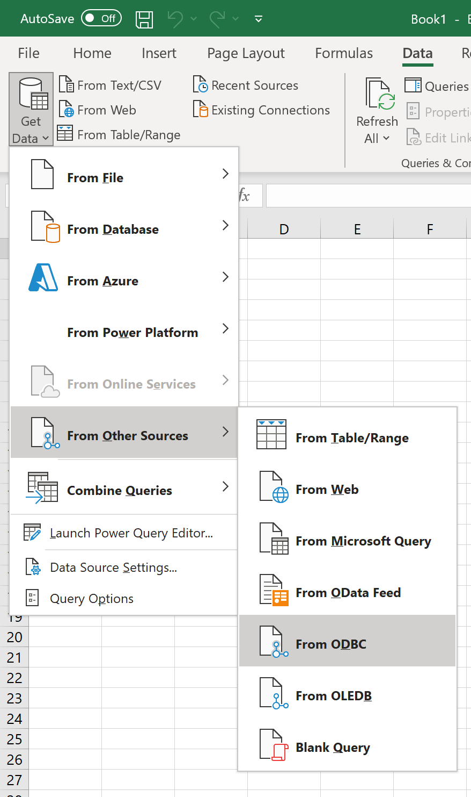
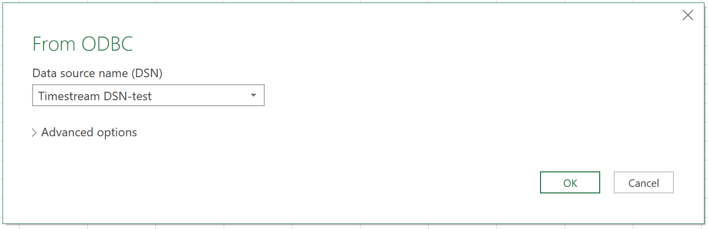
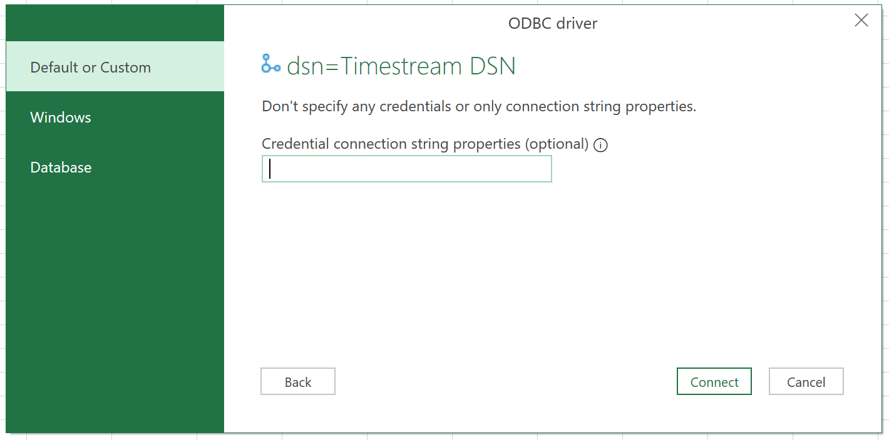
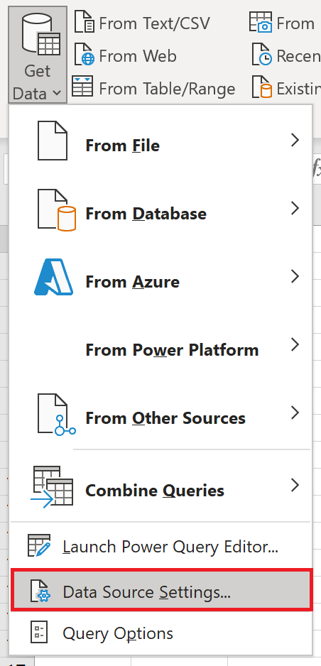
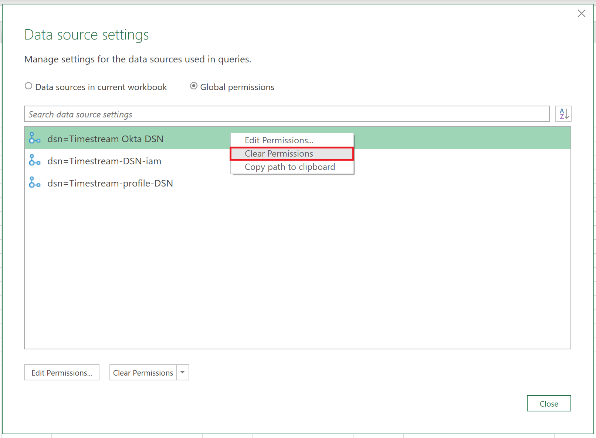
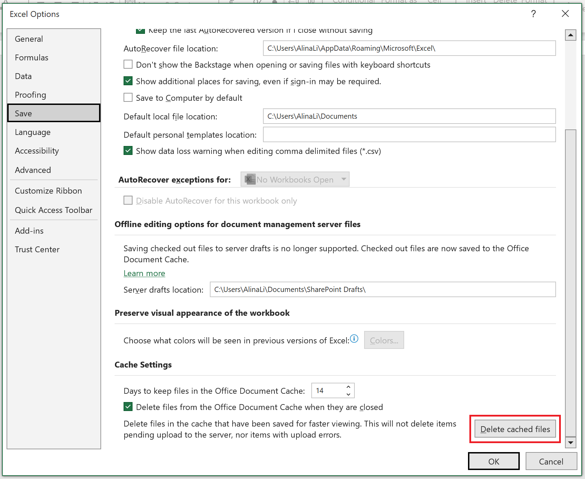
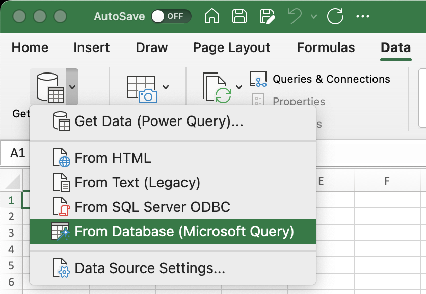
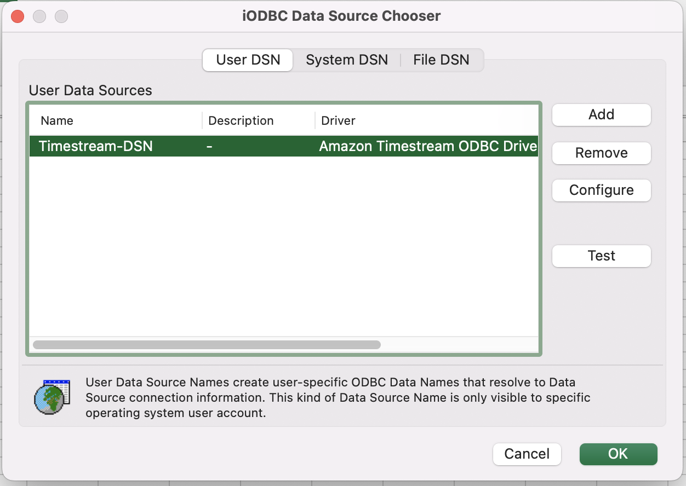

# Microsoft Excel - Connecting to an Amazon Timestream ODBC data source

## Topics
- [Excel on Windows](#windows)
- [Excel on MacOS](#macos)

# Windows

## Prerequisites
Before you get started, [configure the Amazon Timestream ODBC driver DSN](windows-dsn-configuration.md) using the Windows ODBC Data Source Administrator. 

## Connecting to an ODBC data source

1. Open Excel

2. Go to "Data" tab

3. Go to "Get Data" -> Click "From Other Sources" -> Click "From ODBC"

4. Choose predefined DSN (e.g., Timestream DSN-test), click "OK"

5. If this is the first time connecting to this DSN, select the authentication type and input your credentials when prompted. The authentication types available are:

    * Default or Custom: Select this authentication type when you don't specify any credentials when the DSN is configured with a username and password.
    * Windows: Select this authentication type if you want to connect using Windows authentication.
    * Database: Select this authentication type to use a username and password to access a data source with an ODBC driver. This is the default selection.

   Once you are done, click `Connect`.

6. You're now successfully connected on Excel

## Trouble-shooting Guide
I am experiencing data-loading issues with Excel after version update or updating environment variable `DATABASE_AS_SCHEMA`. For example, Excel is not prefixing the database name to the table name in the from clause on the query.

We suggest to remove saved cache and try loading data again.

1. Remove saved DSN. Go to "Get Data" -> Click "Data Source Settings".

    

2. Click on "Clear Permissions" for DSN that you want to connect.

    

3. Remove cached files. Go to "File" -> "Options" -> "Save" -> Click "Delete cached files"

    

4. Load data from Excel.

# MacOS

## Prerequisites
Before you get started, [configure the Amazon Timestream ODBC driver DSN](macOS-dsn-configuration.md) by using the iODBC 
Driver Manager or editing `odbcinst.ini` file.

## Connecting to an ODBC data source

1. Open Excel

2. Create new excel sheet

3. Go to "Data" tab -> Click the arrow beside "Get Data (Power Query)" -> Click "From Database"

4. choose pre-defined DSN (e.g., Timestream-DSN) and click "Ok"

5. You're now successfully connected on Excel
