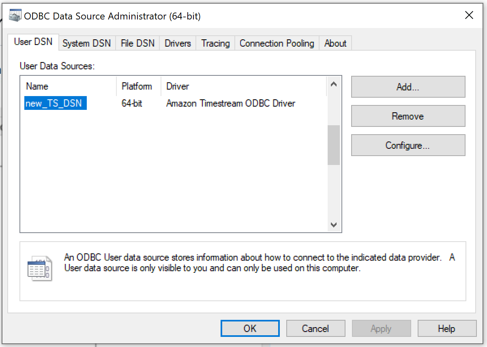
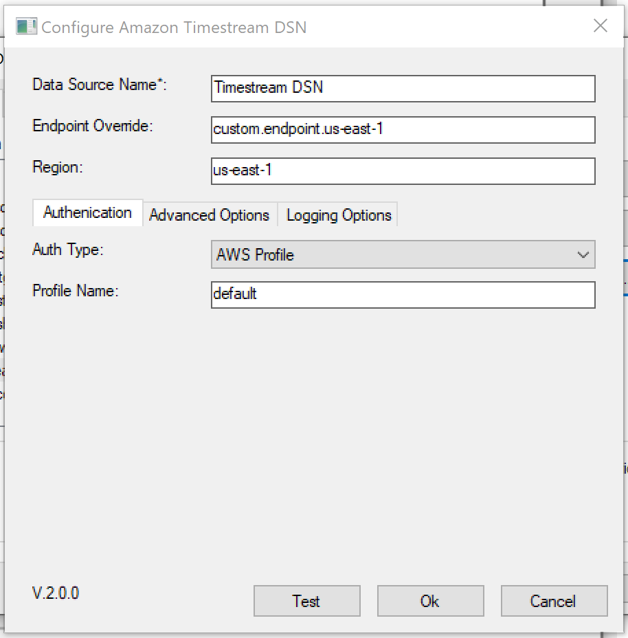
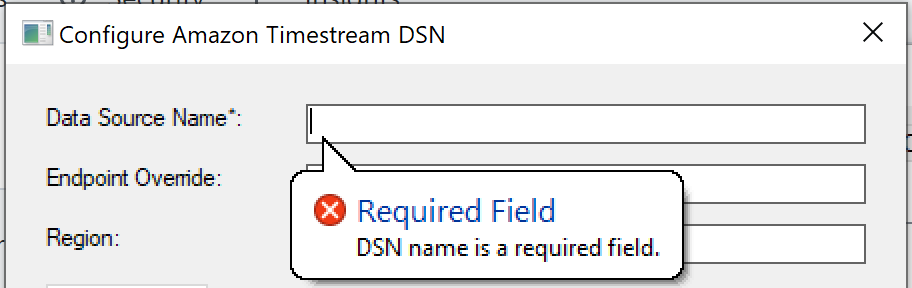

# Amazon Timestream ODBC Driver Setup

1. Open ODBC Driver Data Source Administrator (choose the proper bitness: 32 or 64)
    
2. Click on Add a new DSN.
3. Choose Amazon Timestream.
4. Fill the Windows Form properly.
    

## Notes

- When Okta or AAD is selected for AuthType field, the access key ID, secret access key and session token fields will be disabled as they are not needed.

- Balloons would appear as tips when wrong input is entered for selected field. Clicking out of the field would cause the balloon to temporarily disappear. 

