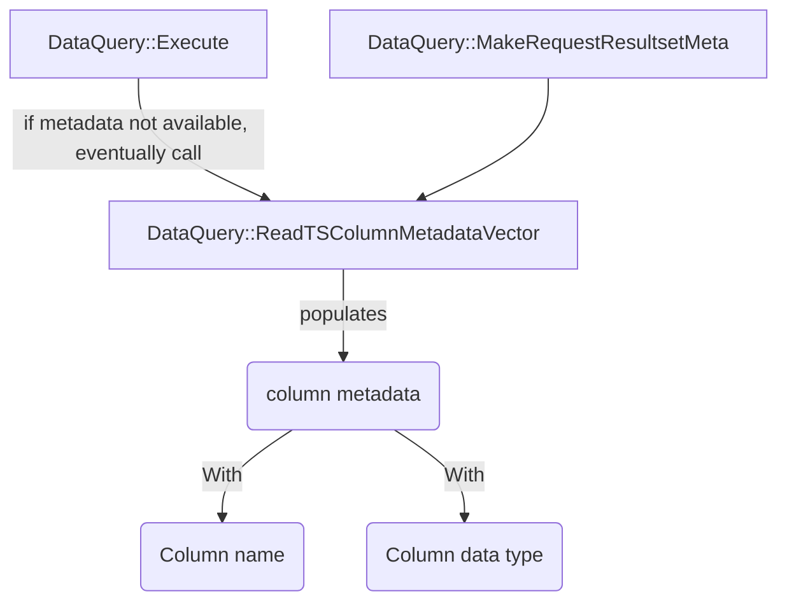
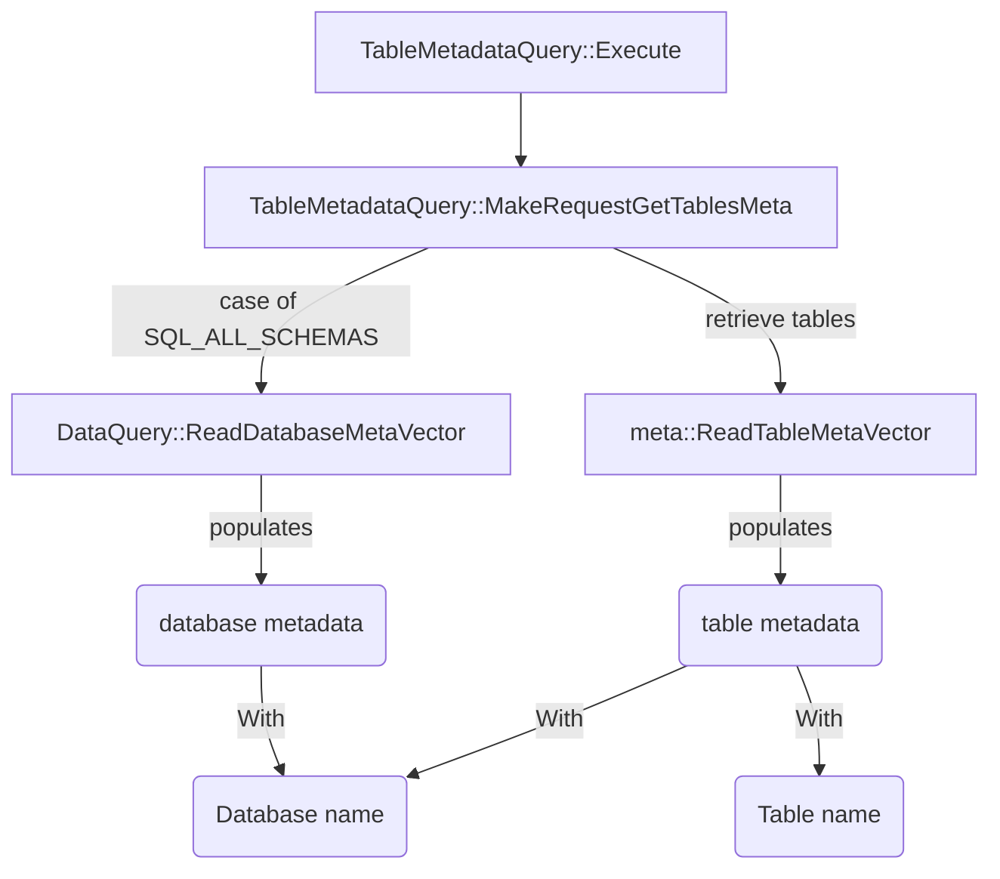

# Metadata Design

## How column metadata for query execution works
Below is a diagram of how column metadata (type ColumnMeta) is populated using DataQuery class functions.

## How table metadata works
Below is a diagram of how table metadata (type TableMeta) is populated using TableMetadataQuery class functions.

In order to retrieve all database information and all table information, TimestreamWriteClient is used for its API functions [ListDatabases](https://sdk.amazonaws.com/cpp/api/LATEST/class_aws_1_1_timestream_write_1_1_timestream_write_client.html#a74b00020da99c43e0e71f57ef68720e6) and [ListTables](https://sdk.amazonaws.com/cpp/api/LATEST/class_aws_1_1_timestream_write_1_1_timestream_write_client.html#abe2ccbfbe9f2424ce7b9dc182d64c86b). Although it is a write client, the current code only uses it for query purposes in this read-only driver.
