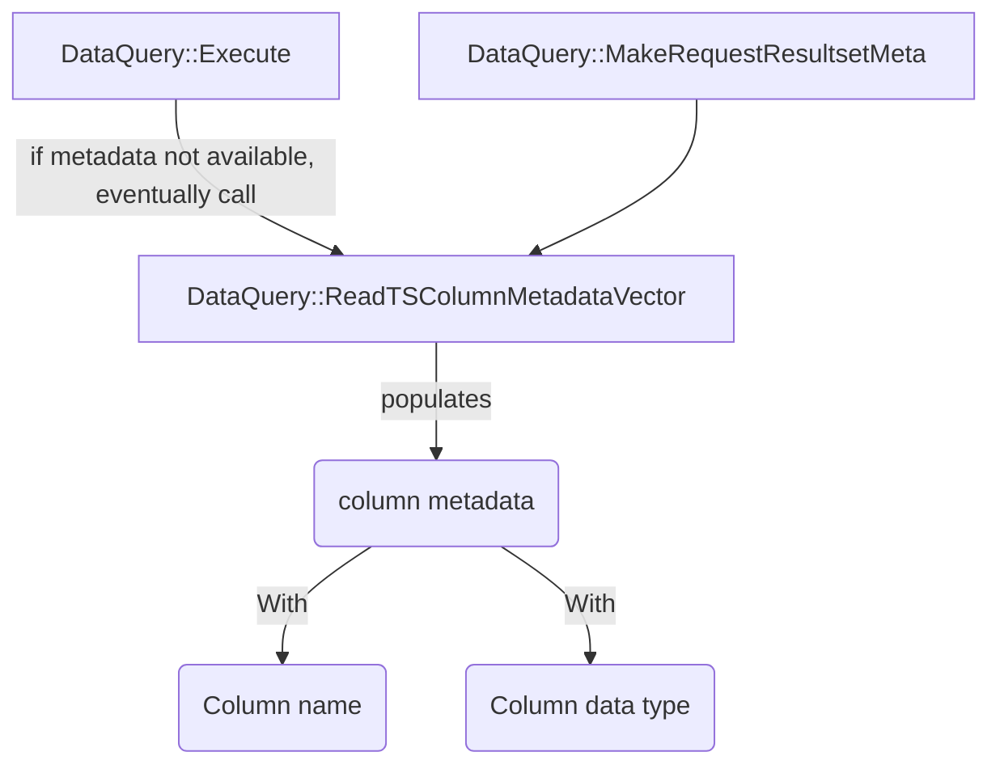

# Metadata Design

## How column metadata works
Below is a diagram of how column metadata (type ColumnMeta) is populated using DataQuery class functions.

```mermaid
graph TD
    A[DataQuery::Execute] -->|if metadata not available, eventually call| B[DataQuery::ReadTSColumnMetadataVector]
    G[DataQuery::MakeRequestResultsetMeta] --> B
    B --> |populates| C(column metadata)
    C -->|With| D(Column name)
    C -->|With| E(Column data type)
```
