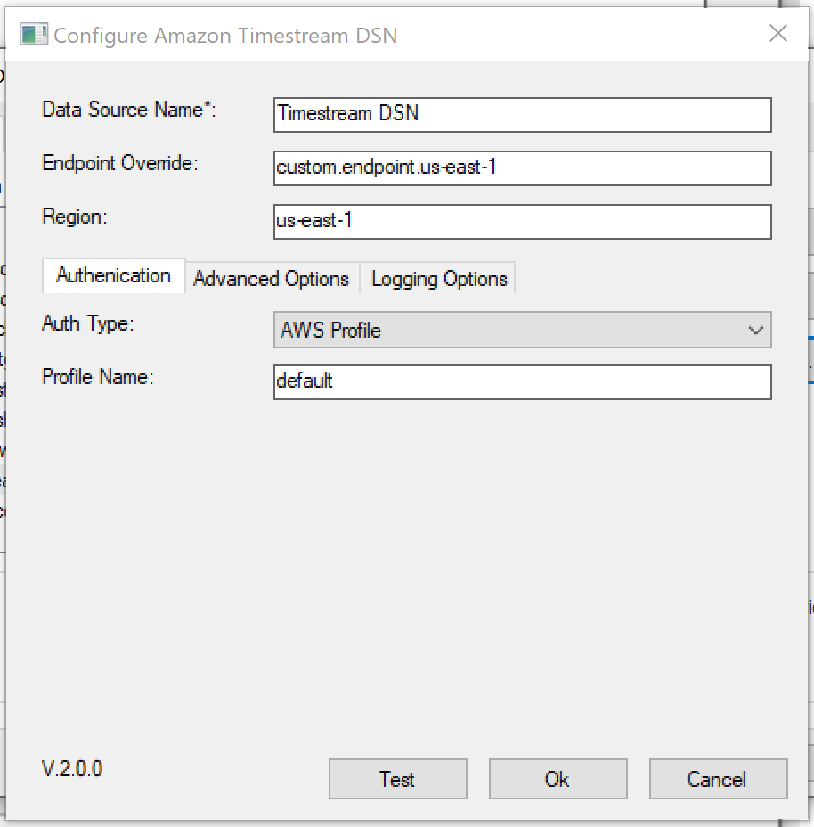

# Amazon TimeStream ODBC Driver Setup

1. Open ODBC Driver Data Source Administrator (choose the proper bitness: 32 or 64)
    
2. Click on Add a new DSN.
3. Choose Amazon TimeStream.
4. Fill the Windows Form properly. 
    